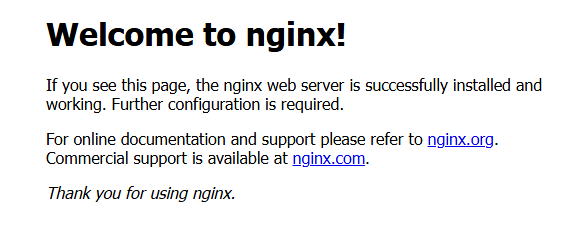

# Week 6 – Docker & Containers: Daily Practice Tasks

<details>
<summary><strong>Task 1 – Introduction to Docker CLI ✅</strong></summary>

✅ **Goal**: Install Docker and learn basic CLI operations.

---

### 🧰 Step-by-step Instructions

1. **Install Docker** on your system from [https://docs.docker.com/get-docker](https://docs.docker.com/get-docker).
2. **Verify installation** by running your first container:

   ```bash
   docker run hello-world
   ```

   You should see a message saying Docker is installed and working.

   📌 This command also pulls the hello-world image from Docker Hub if it's not already present on your machine.

### 🔍 Explore Docker CLI

Use the following commands to explore and manage Docker containers and images:

```bash
docker ps            # Show running containers  
docker ps -a         # Show all containers (including stopped)  
docker images        # List all images  
docker stop <id>     # Stop a running container  
docker rm <id>       # Remove a stopped container  
docker rmi <id>      # Remove an image
```

📌 Replace <id> with the actual container ID, image ID, or name from the listing commands. Both ID and name can usually be used.


</details>

<details>
<summary><strong>Task 2 – Working with Docker Images ✅</strong></summary>

✅ **Goal**: Run two different NGINX containers, understand the differences between them, and manage containers using Docker CLI.

---

### 🧰 Step-by-step Instructions

1. **Run the default NGINX container** on port 8080:

```bash
docker run -p 8080:80 -d --name my_nginx nginx
```

✅ **Explanation**:
- `-p 8080:80` maps port 80 inside the container to port 8080 on your host.
- `-d` runs the container in detached mode (in the background). Without it, the container runs in the foreground and you see the logs directly.
- `--name my_nginx` assigns a custom name to the container (instead of letting Docker auto-generate a random name like `elegant_fermi`).

2. **Run the Alpine version of NGINX** on port 8081:

```bash
docker run -p 8081:80 -d --name my_nginx_alpine nginx:alpine
```

If this is your first time using the `nginx:alpine` image, Docker will download it from Docker Hub.

---

### 🔍 View All Images

```bash
docker images
```

📌 Example output:

| REPOSITORY | TAG    | IMAGE ID       | SIZE    |
|------------|--------|----------------|---------|
| nginx      | latest | fb39280b7b9e   | 279MB   |
| nginx      | alpine | 65645c7bb6a0   | 73.6MB  |

**Difference**: `nginx:alpine` is much smaller in size and is based on Alpine Linux, which is a minimal, security-oriented Linux distribution. It's preferred for lightweight containers.

---

### 🔍 Test the Containers

```bash
curl http://localhost:8080
curl http://localhost:8081
```

Both commands should return HTML with the default NGINX welcome page.

---

### 🌐 Browser Preview

Open your browser and visit:
- http://localhost:8080
- http://localhost:8081

📸 **Screenshot**:  



---

### 🧼 Clean Up

To stop the containers:

```bash
docker stop my_nginx
docker stop my_nginx_alpine
```

To remove the containers:

```bash
docker rm my_nginx
docker rm my_nginx_alpine
```

To remove the images (optional):

```bash
docker rmi nginx
docker rmi nginx:alpine
```

📌 You must stop and remove the containers before you can delete the images they're using.

---

</details>

<details>
<summary><strong>Task 3 – Dockerfile Basics ✅</strong></summary>

✅ **Goal**: Learn how to create a Dockerfile, build a custom image, run a Flask app inside a container, and use `.dockerignore` to optimize the image.

---

### 📦 Step 1: Create a simple Flask app

Create a new folder and add a Python script named `app.py`:

```bash
mkdir flask-app
cd flask-app
```

Create the file:

**app.py**:
```bash
from flask import Flask
app = Flask(__name__)

@app.route("/")
def hello():
    return "Hello from Docker!"

if __name__ == "__main__":
    app.run(host="0.0.0.0", port=5000)
```

---

### 📝 Step 2: Create requirements.txt

```bash
flask
```

---

### 🛠️ Step 3: Create Dockerfile

**Dockerfile**:
```bash
# 1. Use a small and official Python base image
FROM python:3.10-slim
```
🔹 `FROM python:3.10-slim` – Every Docker image starts from a base image – this provides the foundational environment needed to run your app.
In our case, python:3.10-slim includes a minimal Python installation, so we don't need to manually install Python or OS libraries.
Without a base image, you would have to build everything from scratch – including the operating system!

```bash
# 2. Set the working directory inside the container
WORKDIR /app
```
🔹 `WORKDIR /app` – Sets the current directory inside the container to `/app`. All future commands like `COPY` or `RUN` will operate relative to this directory.

```bash
# 3. Copy requirements and install packages
COPY requirements.txt .
RUN pip install --no-cache-dir -r requirements.txt
```
🔹 `COPY requirements.txt .` – Copies the file from your local folder into the container's `/app` directory.  
🔹 `RUN pip install --no-cache-dir -r requirements.txt` – Installs the Python packages listed, and `--no-cache-dir` reduces final image size.

```bash
# 4. Copy the rest of the source code
COPY . .
```
🔹 `COPY . .` – Copies all files from your local directory into the container, **except those excluded by `.dockerignore`**.

```bash
# 5. Expose the port the app will run on
EXPOSE 5000
```
🔹 `EXPOSE 5000` 

 Documents that the container uses port 5000 (used by Flask). This is **for documentation only** – to actually publish the port, use `-p` in `docker run`.

```bash
# 6. Define the default command to run the app
CMD ["python", "app.py"]
```
🔹 `CMD` 

RUN is used when building the image – it runs a command at build-time (like installing packages).

CMD is used when running the container – it tells Docker what command to execute when the container starts.

In our case:

RUN pip install ... installs Flask during the build

CMD ["python", "app.py"] runs the server when the container starts

🔥 If you used RUN python app.py, it would run during the build, and not actually run when you docker run the container.

---

### ⚙️ Step 4: Add .dockerignore

**.dockerignore**:
```bash
__pycache__/
*.pyc
*.pyo
*.pyd
.env
.dockerignore
Dockerfile
```

📌 **Explanation**:  
This file tells Docker to **exclude** certain files/folders from being copied into the Docker image when running `docker build`.

- Prevents adding Python cache files (`__pycache__`, `.pyc`, etc.)
- Prevents leaking `.env` files (which often contain secrets)
- Prevents including the `Dockerfile` and `.dockerignore` themselves

---

### 🏗️ Step 5: Build the Docker image

```bash
docker build -t flask-hello .
```

---

### 🚀 Step 6: Run the container

```bash
docker run -p 5000:5000 --name my_flask_app flask-hello
```

Now open your browser at:  
[http://localhost:5000](http://localhost:5000)

You should see:  
**Hello from Docker!**

📸 **Screenshot**:  


---

### 🔍 Step 7: Comparing with and without `.dockerignore`

To **see the effect of `.dockerignore`**, we’ll:

1. Build the image normally (with `.dockerignore`)
2. Then temporarily remove the file and rebuild
3. Compare the output – look for the **Build Context size**

#### 1. Build with `.dockerignore`

```bash
docker build -t flask-with-ignore .
```

You will see something like:

```bash
Sending build context to Docker daemon 10.24kB
```


#### 2. Build without `.dockerignore`

Rename the file so it doesn't apply:

```bash
mv .dockerignore _dockerignore.bak
docker build -t flask-no-ignore .
```

Now the output might say:

```bash
Sending build context to Docker daemon 1.5MB
```

📌 **Why does it matter?**  
A larger build context means slower builds, bigger images, and possibly leaking secrets or unnecessary files.  
Using `.dockerignore` is a **best practice**!

---

### 🧼 Step 8: Clean up

```bash
docker stop my_flask_app
docker rm my_flask_app
docker rmi flask-hello flask-without-ignore
```

---

</details>

<details>
<summary><strong>Task 4 – Custom Networking and Multi-container Setup ✅</strong></summary>

✅ **Goal**: Create a custom Docker network and run two containers on it so they can communicate by container names.

---

### 🧰 Step-by-step Instructions

1. **Create a custom Docker network**

```bash
docker network create mynet
```

2. **List all Docker networks to see the newly created network**

```bash
docker network ls
```

This will output something like:

| NETWORK ID   |  NAME  | DRIVER | SCOPE   |
|--------------|--------|--------|---------|
| 2b3cd0e8b3c4 | bridge | bridge | local   |
| 2074d312a583 | host   | host   | local   |
| ee5a1e80c9af | mynet  | bridge | local   |
| 3901d607a1bd | none   | none    | local  |

---

3. **Run a database container (e.g., MySQL) attached to the custom network**

```bash
docker run -d --name mydb --network mynet
-e MYSQL_USER=myuser -e MYSQL_ROOT_PASSWORD=rootpassword mysql:8
```

**Explanation of command parts:**

- `docker run` — Runs a new container.
- `-d` — Runs the container in detached mode (in the background).
- `--name mydb` — Assigns the name `mydb` to the container (makes it easier to reference).
- `--network mynet` — Connects the container to the custom Docker network `mynet`.
- `-e MYSQL_USER=myuser -e MYSQL_ROOT_PASSWORD=rootpassword` — Sets an environment variable inside the container to configure MySQL user and password.
- `mysql:8` — Uses the official MySQL image, version 8.

---

4. **Run a web app container (e.g., NGINX) attached to the same network**

```bash
docker run -d --name myweb --network mynet -p 8080:80 nginx
```

**Explanation of command parts:**

- `docker run` — Runs a new container.
- `-d` — Runs the container in detached mode.
- `--name myweb` — Assigns the name `myweb` to the container.
- `--network mynet` — Connects the container to the custom Docker network `mynet`.
- `-p 8080:80` — Maps port 80 inside the container (NGINX default) to port 8080 on the host machine, so you can access the web server via `http://localhost:8080`.
- `nginx` — Uses the official NGINX image.

---

5. **Verify communication between containers**

- Enter the web container's shell:

```bash
docker exec -it myweb sh
```

- From inside the container, ping the database container by its name:

```bash
ping mydb
```

If you see successful ping replies, it means the containers can resolve and communicate using their container names, thanks to the custom network.

---

### 🧼 Cleanup

To stop and remove containers and the network:

```bash
docker stop myweb mydb
docker rm myweb mydb
docker network rm mynet
```

</details>


<details>
<summary><strong>Task 5 – Docker Compose Intro</strong></summary>

✅ **Goal**: Create a multi-service Docker environment with NGINX and MySQL using Docker Compose, with custom network and persistent volumes.

## 🐳 Services

### 1. web (NGINX)  
- **Image:** nginx:alpine  
- **Container name:** my_nginx  
- **Ports:** Maps host port `8080` to container port `80`  
- **Network:** Connected to custom bridge network `mynet`  

### 2. db (MySQL)  
- **Image:** mysql:8  
- **Container name:** my_mysql  
- **Environment Variables:**  
  - `MYSQL_USER=user`  
  - `MYSQL_PASSWORD=password`  
  - `MYSQL_DATABASE=mydb`  
- **Ports:** Exposes port `3306` (default MySQL port)  
- **Volumes:** Persists database data in a named volume `db_data`  
- **Network:** Connected to the same network `mynet`  

---

## 🔧 Volumes  
- `db_data`: Used to persist MySQL database data outside the container.  

---

## 🌐 Network  
- `mynet`: Custom user-defined bridge network for inter-container communication.  

---

## 🚀 Usage  

### Start the environment:  
```bash
docker-compose up -d
```

### Stop and remove containers, networks, and volumes:  
```bash
docker-compose down
```

### View logs live:  
```bash
docker-compose logs -f
```

---

## 📁 docker-compose.yml  
```yaml
version: '3.9'

services:
  web:
    image: nginx:alpine
    container_name: my_nginx
    ports:
      - "8080:80"
    networks:
      - mynet

  db:
    image: mysql:8
    container_name: my_mysql
    environment:
      MYSQL_USER: user
      MYSQL_PASSWORD: password
      MYSQL_DATABASE: mydb
    ports:
      - "3306:3306"
    volumes:
      - db_data:/var/lib/mysql
    networks:
      - mynet

volumes:
  db_data:

networks:
  mynet:
    driver: bridge
```

---

## 🔍 Verify connectivity  

To verify that the web container can communicate with the db container by container name, run:  

```bash
docker exec -it my_nginx sh
ping my_mysql
```

Successful ping responses confirm network communication.

---

## 🧼 Cleanup  

To clean up everything:  

```bash
docker-compose down
docker volume rm db_data
docker network rm mynet
```

</details>

<details>
<summary><strong>Task 6 – Monitoring & Logging Basics</strong></summary>

## ✅ **Goal**
Learn how to add basic monitoring and logging to a containerized application.  
This includes setting up a health check, logging HTTP requests, and checking container health and logs using Docker CLI.

---

## 📄 Files

### 🐍 `app.py`

```bash
import logging
from flask import Flask, request

app = Flask(__name__)

# Setup logging
logging.basicConfig(level=logging.INFO)

@app.before_request
def log_request_info():
    app.logger.info(f"{request.method} {request.path} from {request.remote_addr}")
    
@app.route("/")
def hello():
    return "Hello from Docker"

@app.route("/health")
def health():
    return "OK", 200

if __name__ == "__main__":
    app.run(host="0.0.0.0", port=5000)
```

---

### 🐳 `Dockerfile`

```bash
# 🔹 Base image: using lightweight official Python image with pip
FROM python:3.11-slim

# 🔹 Set working directory inside container
WORKDIR /app

# 🔹 Copy files to container
COPY app.py .
COPY requirements.txt .

# 🔹 Install Python dependencies
RUN pip install --no-cache-dir -r requirements.txt

# 🔹 Optional: document the port used by the app (Flask uses 5000)
EXPOSE 5000

# 🔹 Healthcheck to monitor the container
HEALTHCHECK --interval=30s --timeout=5s --start-period=5s --retries=3 \
  CMD curl -f http://localhost:5000/health || exit 1

# 🔹 Run the app when the container starts
CMD ["python", "app.py"]
```

#### 🔍 HEALTHCHECK Parameters Breakdown

| Parameter             | Description                                                                                   |
|-----------------------|-----------------------------------------------------------------------------------------------|
| `--interval=30s`      | Time between running each health check (default: 30s here).                                   |
| `--timeout=5s`        | Maximum time allowed for the health check command to run (default: 5s here).                  |
| `--start-period=5s`   | Grace period after container starts before health checks begin (useful for slow startups).    |
| `--retries=3`         | Number of consecutive failures needed before marking the container as `unhealthy`.            |
| `CMD curl -f http://localhost:5000/health \|\| exit 1` | Command to execute; returns success if the endpoint responds with status code 200. |

---

## ▶️ How to Run

Build and run the container:

```bash
docker build -t flask-healthcheck .
docker run -p 5000:5000 flask-healthcheck
```
---

## 🔍 How to Test

### 1. **Check logs**

To see the logged requests:

```bash
docker logs <container_id>
```

You should see log entries like:

```txt
INFO:werkzeug:GET / from 172.17.0.1
```

---

### 2. **Check health status**

Run:

```bash
docker inspect --format='{{json .State.Health}}' <container_id>
```

Expected output:

```txt
{
  "Status": "healthy",
  ...
}
```

You can also simulate failure by temporarily changing the `/health` route or blocking port 5000.

---

</details>

<details>
<summary><strong>Task 7 – Advanced Docker Features</strong></summary>

- Tag your image with versions like `myapp:1.0.0`
- Use `docker push` to upload to Docker Hub (optional)
- Use `node:alpine` or `python:slim` to compare performance and size
- Connect your container status to Slack via webhook or simulate a post-build notification
- Bonus: Build a small web app that logs hits and returns a status code (200/500) for healthcheck testing

</details>
